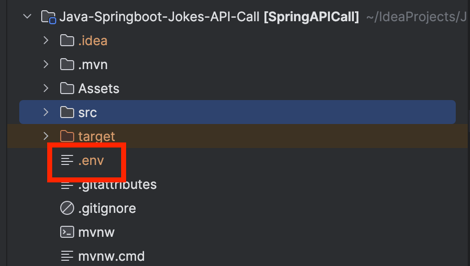
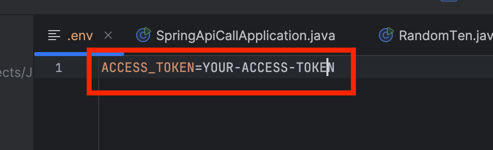

# Java-Springboot-Jokes-API-Call

## 🛠️Setup

1. Add `.env` file in the ROOT directory

2. Get your GitHub access key for SuperHero API (https://www.superheroapi.com/) and paste it in the `.env` file

# ✅ Output

1. Jokes API - Random Ten Jokes

2. SuperHero API - Two Endpoints

